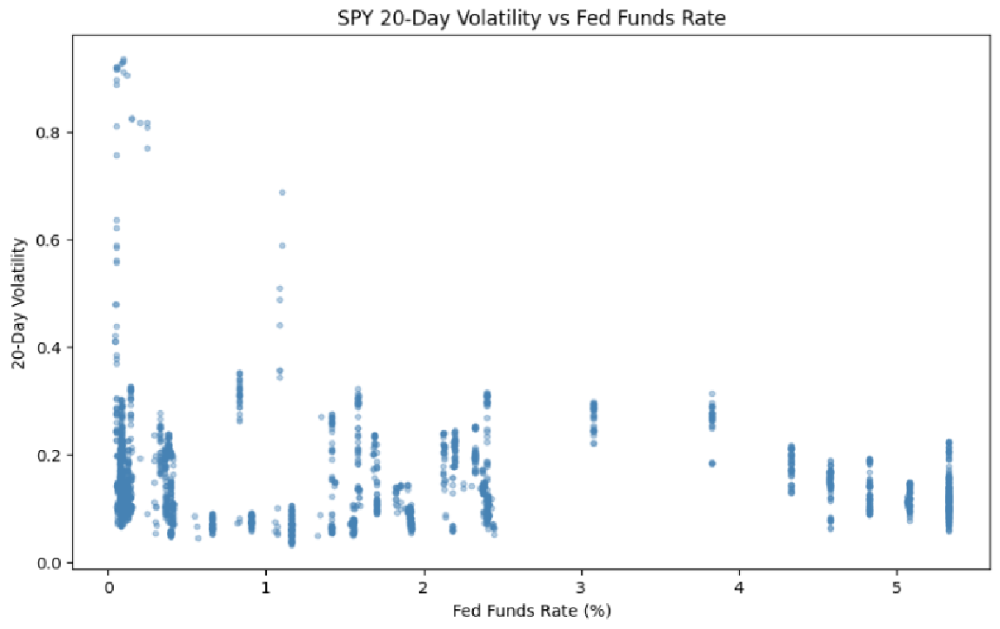

## 🚀 Executive Summary

- **Goal:** Analyze how U.S. Federal Reserve interest rate changes affect SPY (S&P 500 ETF).  
- **Methods:** Combined SPY prices with Fed Funds Rate, CPI, VIX, unemployment, and Treasury yields; ran correlations, regressions, event studies, and strategy simulations.  
- **Findings:**  
  - Daily SPY returns show weak direct correlation with Fed Funds levels.  
  - Significant short-term effects: negative returns after rate hikes, positive lagged effects after a few days.  
  - Volatility decreases as Fed Funds rise.  
  - A simple event-based strategy (moving to cash around FOMC) outperformed buy-and-hold (higher return, lower vol, higher Sharpe).  
- **Next Steps:** Add nonlinear models (Markov regime-switching), expand to sector ETFs, and test robustness with transaction costs.

## 📈 Analyzing the Impact of Federal Reserve Interest Rate Changes on SPY

This project investigates the historical relationship between changes in the Federal Funds Rate, the primary monetary policy tool of the U.S. Federal Reserve, and the performance of the SPDR S&P 500 ETF (SPY).

**The analysis explores:**

Correlations and lagged effects

Regression models for returns and volatility

Market behavior around FOMC announcements

A simple trading strategy based on event windows

The goal: to understand if, and how, Fed interest rate dynamics have influenced U.S. equity markets.

## 📊 Data Sources (2015–2025)

SPY (S&P 500 ETF): OHLCV daily data via yfinance.

Fed Funds Rate (DFF): Daily effective rate from FRED via pandas_datareader.

Additional variables (for context/regressions):

CPI (inflation) – FRED

Unemployment Rate – FRED

VIX (volatility index) – Yahoo Finance

10-Year Treasury Yield – FRED

All series were aligned to SPY trading days; missing values forward-filled.

## 🧪 Methodology

Data Wrangling: Merge SPY + macro data, compute daily returns & 20-day rolling volatility.

Regime Definition: Categorize Low/Medium/High Fed Funds Rate via quantiles.

Correlation Analysis: Overall, regime-specific, and lagged correlations.

**Regression Analysis:**

Returns ~ lagged Fed Funds changes

Volatility ~ Fed Funds level & changes (+ macro controls)

Event Study: Average SPY returns around scheduled FOMC announcements, grouped by rate hikes, cuts, or no changes.

Trading Simulation: Compare buy-and-hold vs. moving to cash in a 5-day FOMC event window.

## 🔑 Key Findings

**Correlation:**

Overall relationship between SPY returns and Fed Funds levels ≈ 0.

Weak differences across regimes: slightly negative in Low, slightly positive in High.

Lagged Effects:

Small negative effect at 1-day lag (p ≈ 0.06).

Statistically significant positive effect at 5-day lag (p < 0.01).

R² very low → Fed Funds changes explain little of daily return variance.

**Volatility:**

Higher Fed Funds levels associated with lower SPY volatility (significant, but small effect).

R² remains modest; volatility driven by broader factors.

**Event Study:**

Slightly negative average return across 5-day FOMC window.

Rate hikes → negative drift; cuts/no-change → mixed patterns.

**Trading Strategy:**

“Move to cash” during FOMC windows outperformed buy-and-hold (2015–2024):

Total Return: 2.61 vs 1.85

Annualized Return: 13.7% vs 11.1%

Volatility: 15.9% vs 17.7%

Sharpe Ratio: 0.87 vs 0.63

## 📉 Visual Results

### 📈 Equity Curve: Buy & Hold vs. FOMC Strategy

### 📊 Average Returns Around FOMC Announcements
*(Placeholder — save your plot as `images/fomc_event_returns.png` when ready)*  

### 📉 Volatility vs. Fed Funds
*(Placeholder — save your plot as `images/vol_vs_rate.png` when ready)*  

## 🚀 Future Work

Enrich regressions with CPI, VIX, unemployment, and yield curve dynamics.

Explore nonlinear models (Markov regime-switching, ML approaches).

Extend event studies to sector ETFs and bonds.

Test robustness of strategy with transaction costs and alternate event windows.

Examine magnitude & surprise of Fed decisions (not just direction).
